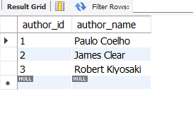
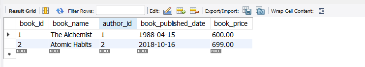
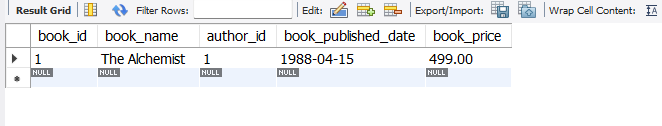

#  DB QUERY

This repository demonstrates **CRUD operations** using:

- **MongoDB (NoSQL)**
- **SQL (Relational Database)**

Example project: **Book Shop Database**

---

#  MongoDB CRUD Queries

Basic CRUD operations using **MongoDB**.

---

##  Create Database

```javascript
use("book_shop")
```


---

##  Insert One Document

```javascript
db.books.insertOne({
  id: 1,
  book_name: "The Alchemist",
  book_author: "Paulo Coelho",
  book_published_date: "1988-04-15",
  book_price: 499
})
```


---

##  Insert Multiple Documents

```javascript
db.books.insertMany([
{
  id: 2,
  book_name: "Atomic Habits",
  book_author: "James Clear",
  book_published_date: "2018-10-16",
  book_price: 699
},
{
  id: 3,
  book_name: "Rich Dad Poor Dad",
  book_author: "Robert Kiyosaki",
  book_published_date: "1997-04-01",
  book_price: 550
}
])
```


---

##  Update One Document

```javascript
db.books.updateOne(
 { id: 1 },
 { $set: { book_price: 600 } }
)
```


---

##  Update Multiple Documents

```javascript
db.books.updateMany(
 { book_price: { $lt: 600 } },
 { $set: { book_price: 600 } }
)
```


---

##  Find One Document

```javascript
db.books.findOne({ id: 1 })
```


---

##  Find All Documents

```javascript
db.books.find()
```


---

##  Delete One Document

```javascript
db.books.deleteOne({ id: 2 })
```


---

##  Delete Multiple Documents

```javascript
db.books.deleteMany({ book_price: { $gt: 500 } })
```


---

#  SQL CRUD Queries (Book Shop Database)

Basic CRUD operations using SQL with **Foreign Key relationship**.

---

## Create Database

```sql
CREATE DATABASE book_shop;
USE book_shop;
```

---

## Create Authors Table

```sql
CREATE TABLE authors (
    author_id INT AUTO_INCREMENT PRIMARY KEY,
    author_name VARCHAR(100) NOT NULL
);
```



---

## Create Books Table (Foreign Key)

```sql
CREATE TABLE books (
    book_id INT AUTO_INCREMENT PRIMARY KEY,
    book_name VARCHAR(150) NOT NULL,
    author_id INT,
    book_published_date DATE,
    book_price DECIMAL(10,2),
    FOREIGN KEY (author_id) REFERENCES authors(author_id)
);
```

---

## Insert Author Data

```sql
INSERT INTO authors (author_name)
VALUES
('Paulo Coelho'),
('James Clear'),
('Robert Kiyosaki');
```


---

## Insert Book Data

```sql
INSERT INTO books (book_name, author_id, book_published_date, book_price)
VALUES
('The Alchemist', 1, '1988-04-15', 499),
('Atomic Habits', 2, '2018-10-16', 699),
('Rich Dad Poor Dad', 3, '1997-04-01', 550);
```



---

##  Read All Books with Author Name

```sql
SELECT 
b.book_id,
b.book_name,
a.author_name,
b.book_published_date,
b.book_price
FROM books b
JOIN authors a
ON b.author_id = a.author_id;
```


---

## 🔍 Read One Book

```sql
SELECT * 
FROM books
WHERE book_id = 1;
```



---

##  Update Book Price

```sql
UPDATE books
SET book_price = 600
WHERE book_id = 1;
```

---

##  Delete One Book

```sql
DELETE FROM books
WHERE book_id = 3;
```


---

##  Delete Multiple Books

```sql
DELETE FROM books
WHERE book_price > 500;
```

---

# 🛠 Tools Used

- MongoDB  
- MongoDB Compass  
- MySQL  
- GitHub  

---

# 👩‍💻 Author

**Suganthi**
