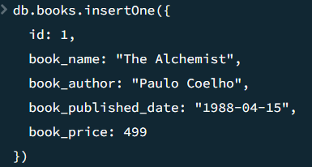
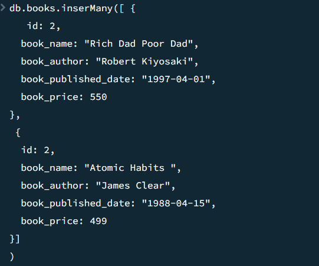
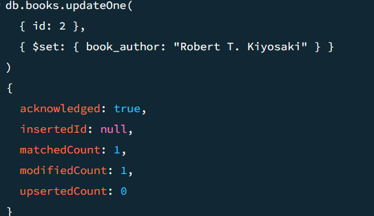
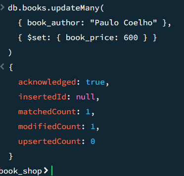
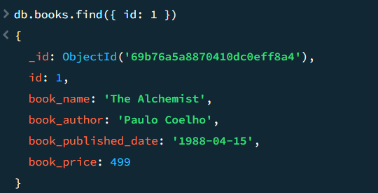
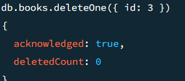
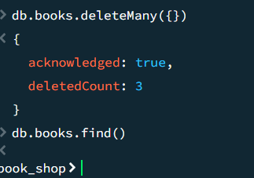

# 📚 DB QUERY

## MongoDB CRUD Queries

Basic **CRUD operations** using **MongoDB** for a **Book Shop database**.

---

## 🗄 Creating Database

```javascript
use("book_shop")
```


---

##  Insert One Data

```javascript
db.books.insertOne({
  id: 1,
  book_name: "The Alchemist",
  book_author: "Paulo Coelho",
  book_published_date: "1988-04-15",
  book_price: 499
})
```



---

##  Insert Many Data

```javascript
db.books.insertMany([
{
  id: 2,
  book_name: "Atomic Habits",
  book_author: "James Clear",
  book_published_date: "2018-10-16",
  book_price: 699
},
{
  id: 3,
  book_name: "Rich Dad Poor Dad",
  book_author: "Robert Kiyosaki",
  book_published_date: "1997-04-01",
  book_price: 550
}
])
```



---

##  Update One Data

```javascript
db.books.updateOne(
 { id: 1 },
 { $set: { book_price: 600 } }
)
```



---

##  Update Many Data

```javascript
db.books.updateMany(
 { book_price: { $lt: 600 } },
 { $set: { book_price: 600 } }
)
```



---

##  Find One Data

```javascript
db.books.findOne({ id: 1 })
```



---

##  Find All Data

```javascript
db.books.find()
```


---

##  Delete One Data

```javascript
db.books.deleteOne({ id: 2 })
```



---

##  Delete Many Data

```javascript
db.books.deleteMany({ book_price: { $gt: 500 } })
```



---


## 🛠 Tools Used

- MongoDB  
- MongoDB Compass  
- GitHub  

---

## 👩‍💻 Author

**Suganthi**
